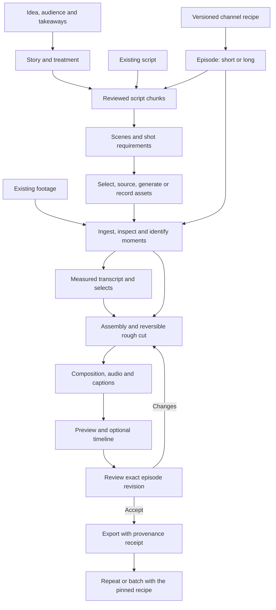
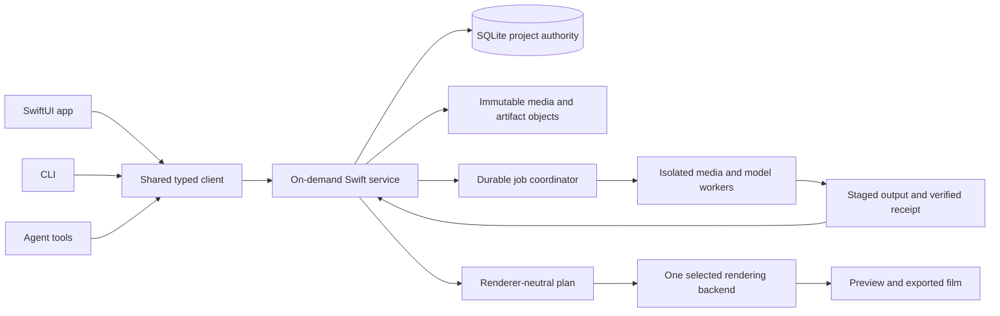

# Takeform architecture proposal

14 September 2026 · proposed v0.1 · design review, not an implementation or release.

Takeform is a Mac-first workspace for making repeatable videos with agents. A creator defines a channel recipe, supplies an idea, script or footage, and reviews the resulting film. The recipe preserves the channel's structure, typography, motion, sound and caption treatment while allowing declared episode variations.

The [architecture evaluation record](architecture-evaluation.md) records the completed design comparison, correction, artifact fingerprints, and open proof obligations.

The product is a production harness: it assembles the right approved context, records decisions, coordinates tools and makes edits reproducible. Models propose creative choices. Typed commands and media tools perform verifiable operations. Creative quality still requires judgement and inspection of the actual film.

## Creator flow

Strategy is useful context, not a required form before editing existing footage. A silent montage can omit narration and captions. Long videos use chapters and script chunks within the same episode model.

## Proposed structure

One `.takeform` package represents a channel, its recipes and its episodes. One on-demand Swift service owns writable state and job transitions. The native app, CLI and agent tools use the same command contract. Workers receive immutable inputs and narrow job capabilities; they do not edit the project database.

SQLite is the writable authority. Immutable content-addressed objects hold media and derived artifacts. JSON snapshots are exports for inspection and deliberate import, not a second live database. Machine-specific bookmarks, credentials and absolute paths stay outside the portable project representation. Managed assets use package-relative locations; external assets require relinking on another machine.

Swift is the proposed owner because the first audience is Mac users and native document access, process lifecycle and distribution matter. A TypeScript service can also maintain one authoritative database with generated wire types. It remains a viable comparison; it is not rejected as inherently inconsistent. The signed service and helper proof must establish whether Swift's integration benefits justify its costs.

## Alternatives considered

| Shape | Decision and reason |
|---|---|
| Linked Swift library with an elected owner | Viable, but transfers ownership between client processes and needs a reliable forwarding/liveness protocol. The proposed service makes ownership explicit across app and CLI lifetimes |
| Per-episode native document kernel | Useful document semantics, but separate recipe/series storage complicates portable channel context. Prefer one self-contained channel package for this product |
| Native UI with a TypeScript authority | Viable with generated wire contracts and one database. Compare actual bridge, packaging and maintenance costs; revisit if the Swift service proof fails |
| Browser-first or hybrid UI | Deferred in favour of the Mac-first product preference. Cross-platform UI benefits do not settle native file access or helper distribution |
| Fully native rendering engine | Deferred while existing renderers are measured. Building motion typography, captions and compositing from scratch would add an unproven subsystem |

## Editing and reliability contracts

| Concern | Proposed contract | Evidence required before claiming it works |
|---|---|---|
| Channel formula | Immutable recipe versions, constrained slots, pinned episode recipe and explicit overrides | Changing a recipe leaves existing episodes unchanged; resolved defaults and overrides validate |
| Creative continuity | Versioned script chunks, scenes, shots and their complete dependency graph | A script change marks indirect dependants for review while preserving unrelated approved work |
| Media identity | Separate source bytes, semantic moment, selected asset and timeline occurrence | Live Photo pairs do not produce accidental repetition; uncertain pairing is reviewable |
| Film time | Distinct rational source/output clocks, measured VFR timestamps and explicit mappings | Fractional frame rates, boundary words, retiming and end frames remain correct |
| Human and agent edits | Authenticated sessions, shared commands, previewable proposals and revocable scoped grants | Unpaired callers cannot approve work or mint their own authority; UI/CLI/tool results agree |
| Concurrent changes | Stable command IDs and transactional revision checks | Duplicate submissions do not repeat actions; stale changes produce explicit conflicts |
| Background work | Durable intent, immutable inputs, attempt leases and verified output promotion | Crash, cancellation and stale worker results cannot manufacture success |
| Paid uncertainty | Persist intent before submission; reconcile before retry; represent unknown outcome even without a remote ID | An ambiguous timeout never triggers an automatic duplicate charge |
| Portability | Controlled close or consistent SQLite backup, complete object inventory and relink flow | Move/reopen after active work without losing WAL contents or silently trusting a newer JSON projection |
| Reproducible export | Pin content, recipe, overrides, backend, toolchain and settings in a receipt | Rebuild and compare output under a defined determinism tolerance |

For v0.1, prefer project-head compare-and-swap with clear conflict/reproposal behaviour over incomplete per-entity conflict checks. Independent jobs may run concurrently under bounded resource limits. Finer episode concurrency must account for write targets, aggregate reads and absence checks before it replaces the simpler rule.

Proposal mode is a useful default, not a permanent restriction on agents. Creators can grant a named session a bounded command set, scope, expiry and budget. A missing agent token is never proof of creator identity. The security model must state the limits of protection against arbitrary code running as the same OS user.

## Renderer decision remains open

Compare HyperFrames and Remotion on the same canonical inputs. Use native media APIs and mature media tooling where they solve a measured need. Choose one production backend after the comparison; avoid maintaining multiple rendering implementations in v0.1.

Preview must state whether it is an interactive approximation or a render-backed proof, and which plan revision it displays. Backend capabilities determine when proof rendering is required. A separate native structural preview is optional research, not an automatic second engine.

Three fixtures gate the choice:

1. **Overlapping montage:** mixed stills/videos, Live Photo alternatives, moving layers, variable durations and explicit no-repeat rules. Check identity coverage, motion, crops, decoded end frames and native preview seeking.
2. **Talking-head edit:** multiple takes, measured words, meaningful pauses, cut-boundary words, VFR media, retiming, captions and mixed audio. Inspect the actual film and compare measured source/output timing.
3. **Thirty-minute chaptered film:** cleared synthetic or reusable test material, fractional frame rates, chapter revisions, captions and audio spanning chapter boundaries. Measure seeking, peak memory, export time, cancellation and recovery. Selective invalidation does not imply safe stream-copy concatenation; joins need explicit transition handles and audio continuity.

Record hardware, OS, tool versions, source hashes, settings, cold/warm runs, failures and observed measurements. Agree numeric acceptance thresholds in the fixture PR before measuring. No performance result or selected renderer is claimed here.

## Agent and provider settings

Provider profiles declare capabilities, model identity, data destination and budgets. Store secrets in Keychain; project snapshots contain only secret-free reproducibility data. Generate CLI/MCP schemas from the shared commands and test for drift.

A Codex integration and a provider-flexible runtime are planned. Neither an app subscription nor an SDK's existence proves the intended integration works. Test the exact session lifecycle, tool registration, cancellation, context isolation and supported authentication. ChatGPT connectivity needs its own demonstrated path. Keep the core independent of any specific agent framework until that proof exists.

## What exists and what remains unproven

This repository currently contains research, a work map and design proposals. There is no installable Takeform app. Design sketches do not prove validation, concurrency, rendering or packaging.

The research supports reusable lessons about channel recipes, media identity, measured timing, command authority and durable jobs. It does not establish a reliable end-to-end product. The largest unresolved risks are signed native helper distribution, native preview fidelity, provider/runtime isolation and licence eligibility for redistributed components and assets.

Fresh-clone development and signed distribution are separate acceptance paths. The developer path needs pinned tools, portable examples and a doctor command. Distribution additionally needs a real app bundle, nested helper signing, entitlements, notarization and fresh-machine verification. A successful Swift package build proves neither path on its own.

## Review sequence

The existing [v0.1 work map](roadmap.md) keeps the complete production workflow. The first changes should answer the riskiest questions before building feature scaffolding:

1. Approve this architecture direction and explicit open decisions.
2. Prove a minimal signed app/service/CLI/helper path, including file access and cancellation. Compare an alternative topology if the chosen one fails.
3. Build cleared canonical fixtures and run the renderer/native preview comparison.
4. Select the backend and establish a reproducible developer foundation.
5. Implement the authoritative command/persistence slice with revision conflict, restart, move and transitive freshness tests.
6. Add channel recipes and one usable footage-to-export vertical slice, then extend through the remaining linked work packages.

Each issue owns an observable outcome and evidence. PRs remain small; documentation, benchmark fixtures, runtime foundations and creator-facing features are reviewed separately. Version 0.1 remains a milestone until the documented acceptance films and public-release checks pass.
