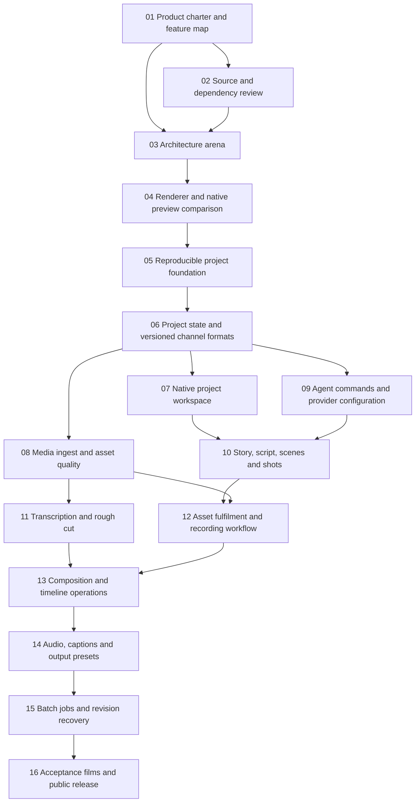

# Video studio v0.1 issue map

14 September 2026. The work packages below are open GitHub issues in the v0.1 milestone. This is an early research roadmap; implementation scope will be refined through evidence and review.

Each work issue must link its PR and evidence. Close it only when its acceptance checks pass. Design proposals and source inspection do not count as runtime proof. Use one active implementation issue per owner. Split any issue that cannot produce a reviewable change. The entries below are work packages; implementation children are opened when their architecture is settled.

## Dependency map

## [01. Define the product charter and executable feature map](https://github.com/vedantggwp/takeform/issues/1)

Outcome: a creator can see what v0.1 intends to support, with short-form and long-form paths and entry from idea, script or footage.

Acceptance: map each user journey to its eventual test command, evidence artifact and status. Distinguish planned, implemented and verified. Include editable channel formulas as a core requirement. Record explicit non-goals without dropping the full production flow. PR contains the charter and feature map only.

## [02. Review candidate components and their release constraints](https://github.com/vedantggwp/takeform/issues/2)

Outcome: a source-backed adopt, adapt, reference or reject decision for each candidate.

Acceptance: pin upstream revisions; inspect implementation and relevant tests; record licensing, media redistribution, runtime requirements and maintenance. Cover HyperFrames, Remotion, HeyGen CLI and skills, native media APIs, transcription, existing experiments and relevant editor alternatives. Do not install cloud services or generate paid assets as part of this issue. PR contains the review and reproducible inspection scripts.

## [03. Compare architectures through the original P-stack arena](https://github.com/vedantggwp/takeform/issues/3)

Outcome: competing caller-first designs and a reviewed synthesis.

Acceptance: record actual model identities, common brief, candidate outputs, withheld scoring rubric, cross-judge, base choice, grafts and rejections. Include at least two structurally distinct designs. Resolve project-state ownership, time model, format versioning, agent authority, preview/render boundary and packaging. Unrun stages remain open. No product implementation in this PR.

## [04. Measure renderers and native preview using identical fixtures](https://github.com/vedantggwp/takeform/issues/4)

Outcome: select the smallest renderer integration that meets the product's requirements.

Acceptance: render an overlapping montage, talking-head edit and chaptered long video in the serious contenders. Inspect motion, text, audio sync, mixed frame rates and end frames. Measure seek latency, memory and export time on a named Mac. Test native preview and packaged helper startup. Include failed attempts. Do not choose from screenshots or README claims. PR contains fixtures, runners, results and decision.

## [05. Establish the new repository and reproducible developer setup](https://github.com/vedantggwp/takeform/issues/5)

Outcome: someone can clone the project and launch a truthful local development build.

Acceptance: pinned tools, lockfiles, portable paths, doctor command, narrow ignores, clean public examples, CI and licence inventory. No tracked dependencies, credentials, personal media or private source paths. Fresh-clone verification under a separate user directory. Version 0.1 is a milestone until release checks pass. PR contains only the chosen foundation.

## [06. Implement project state and versioned channel formats](https://github.com/vedantggwp/takeform/issues/6)

Outcome: a creator saves a format once and produces episodes with consistent branding.

Acceptance: immutable format versions describe beat structure, fixed assets, variable slots, text bounds, timing rules, audio/caption defaults and allowed overrides. Each episode pins its version. Editing a shared format does not silently alter old episodes. Project commands validate inputs, preserve revisions and reject stale writes. Test move, reopen, undo and dependency invalidation. Split persistence and format editor into reviewable children if needed.

## [07. Build the native project workspace](https://github.com/vedantggwp/takeform/issues/7)

Outcome: Mac users open projects, browse production stages, inspect previews and see the state of current work.

Acceptance: native menus, keyboard navigation, drag/drop, inspector, accessible controls and clear empty/error states. Project state survives restart. Agent actions are visible where they affect the work. Timeline is optional. Submit a recorded walkthrough and interaction review before merge.

## [08. Ingest assets and report quality](https://github.com/vedantggwp/takeform/issues/8)

Outcome: files become searchable assets with trustworthy metadata and useful warnings.

Acceptance: preserve originals; hash imports; deduplicate exact files; pair Live Photos using available metadata with explicit uncertain matches; create disposable proxies; retain rotation, audio channels and source timebases. Test missing files, interrupted copy, corrupt inputs and relinking. Quality checks distinguish measured faults from model opinions. No automatic destructive cleanup.

## [09. Expose agent commands and thoughtful provider settings](https://github.com/vedantggwp/takeform/issues/9)

Outcome: UI, CLI and MCP perform the same version-checked project operations.

Acceptance: typed schemas and documented errors; previewable changes; cancellation; explicit model capability checks; credentials outside projects; configurable budgets and data destinations. Prove a Codex path and one provider-flexible path. Test unsupported capabilities and unknown paid-job outcomes. ChatGPT connectivity is a separate tested integration, not an assumed localhost connection.

## [10. Link stories, scripts, scenes and shots](https://github.com/vedantggwp/takeform/issues/10)

Outcome: a creator turns an intended takeaway into a production-ready breakdown within a chosen format.

Acceptance: support script chunks, scene purpose, shot requirements, source claims, pronunciation and series continuity. Agents load relevant approved context. A script revision identifies dependent work and preserves approved versions. Test a chapter change without regenerating unrelated chapters. Allow entry with an existing script or footage.

## [11. Produce a reversible talking-head rough cut](https://github.com/vedantggwp/takeform/issues/11)

Outcome: the creator reviews selected takes, proposed deletions and accurate captions.

Acceptance: measured speech timestamps, corrected transcript, source-to-output mapping, configurable silence margins and retained meaningful pauses. Never infer word timing by dividing a phrase evenly. Test boundary words, repeated takes, multiple speakers and variable-frame-rate footage. Inspect the actual cut for preserved meaning and audiovisual sync.

## [12. Fulfil shots through existing, sourced, generated or recorded assets](https://github.com/vedantggwp/takeform/issues/12)

Outcome: each required shot has an explicit fulfilment state and selected asset.

Acceptance: candidate selection, recording instructions, watched-folder or import association, provenance and rights fields, generation parameters and resumable job IDs. Missing footage remains missing rather than turning into a placeholder success. Test replacing one shot and updating its dependants only.

## [13. Compile and edit compositions](https://github.com/vedantggwp/takeform/issues/13)

Outcome: the same editable plan drives preview, deterministic rendering and agent edits.

Acceptance: trim, split, reorder, replace, layer, retime and undo with explicit source mappings. Render overlapping clips and reusable motion blocks. Reject invalid media ranges and unsupported effects. Preview and export use a tested shared contract. Test simultaneous human and agent edits without lost updates.

## [14. Add captions, audio treatment and output presets](https://github.com/vedantggwp/takeform/issues/14)

Outcome: creators apply a channel's sound and caption treatment consistently and can override it per episode.

Acceptance: caption correction, word-level styles, readable safe areas, dialogue/music/SFX roles, ducking and peak checks. Recalculate timing after edits. Export burned captions and sidecars as chosen. Presets cover aspect ratio, resolution and frame rate. Verify audio by listening and measurements; verify captions during motion.

## [15. Resume batch production and revisions safely](https://github.com/vedantggwp/takeform/issues/15)

Outcome: a queue of episodes can pause, fail and resume without losing approved work or repeating paid requests.

Acceptance: durable progress, bounded concurrency, cancellation, stale-result rejection, input/output hashes, selective regeneration and reconciliation before retry. Test app crash during import, model call and render. Keep providers and render workers separate from authoritative project mutations.

## [16. Verify acceptance films and publish v0.1](https://github.com/vedantggwp/takeform/issues/16)

Outcome: a new user can install or clone and complete the documented workflows.

Acceptance: accepted talking-head, montage, story-first short and chaptered long video. Measure time to accepted output including human correction. Complete fresh-machine setup, privacy and redistribution audit, signed distribution checks where applicable, documentation and known limitations. Public examples contain cleared assets only. Release notes claim only demonstrated behaviour.

## Review rules

Issues own scope, decisions, acceptance evidence and PR links. PRs explain the user-visible change and its proof. Keep deferred ideas in a separate backlog. A small implementation issue should own one observable result and one rollback boundary. Do not close an entire work package because its first child merged.

Product interaction changes require a short video and screenshots for review. Rendering changes require actual rendered media and audio checks. Provider changes require a real bounded integration test plus controlled failure cases. Documentation-only issues do not need invented performance tests.
